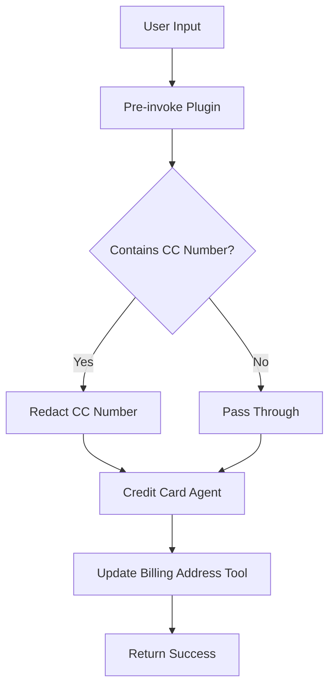

# Credit Card Guardrails Agent

A watsonx Orchestrate agent demonstrating security guardrails through credit card number redaction using pre-invoke plugins.

## Overview

This project showcases how to implement security guardrails in watsonx Orchestrate agents by automatically redacting sensitive information (credit card numbers) before the agent processes user input. The agent helps customers update their credit card billing addresses while protecting sensitive data.

## Features

- **Pre-invoke Guardrail**: Automatically redacts credit card numbers in user messages
- **Credit Card Redaction**: Masks all but the last 4 digits (e.g., `1234 5678 9012 3456` → `**** **** **** 3456`)
- **Billing Address Updates**: Simulates updating billing addresses for credit card accounts
- **Security Best Practices**: Demonstrates how to handle sensitive data in conversational AI

## Project Structure

```
guardrails/
├── README.md                          # This file
├── .gitignore                         # Git ignore patterns
├── requirements.txt                   # Python dependencies
├── import-all.sh                      # Deployment script
├── upload.sh                          # GitHub upload script
├── agents/
│   └── credit_card_agent.yaml        # Agent configuration
└── tools/
    ├── guardrail_cc_preinvoke.py     # Pre-invoke guardrail plugin
    └── update_billing_address.py     # Billing address update tool
```

## Architecture



## Components

### 1. Credit Card Agent (`agents/credit_card_agent.yaml`)
- Native agent specialized in updating credit card billing addresses
- Uses Groq's GPT model for natural language understanding
- Configured with pre-invoke guardrail plugin
- Integrates with billing address update tool

### 2. Guardrail Pre-invoke Plugin (`tools/guardrail_cc_preinvoke.py`)
- Intercepts user messages before agent processing
- Detects credit card numbers in format: `XXXX XXXX XXXX XXXX`
- Redacts all but last 4 digits: `**** **** **** XXXX`
- Ensures sensitive data never reaches the agent's processing logic

### 3. Update Billing Address Tool (`tools/update_billing_address.py`)
- Simulates updating billing address for a credit card account
- Requires admin permission
- Returns JSON response with update status
- In production, would integrate with payment processing systems

## Prerequisites

- IBM watsonx Orchestrate account
- IBM watsonx Orchestrate ADK installed
- Python 3.8+
- GitHub CLI (`gh`) for repository management

## Installation

1. **Install dependencies**:
```bash
pip install -r requirements.txt
```

2. **Deploy to watsonx Orchestrate**:
```bash
chmod +x import-all.sh
./import-all.sh
```

## Usage

### Example Conversation

**User**: "I need to update my billing address for card 1234 5678 9012 3456"

**Agent** (receives): "I need to update my billing address for card **** **** **** 3456"

**Agent**: "I can help you update the billing address for your card ending in 3456. What's the new billing address?"

**User**: "123 Main Street, New York, NY 10001"

**Agent**: "I've successfully updated the billing address for your card ending in 3456 to 123 Main Street, New York, NY 10001."

### Testing the Guardrail

You can test the credit card redaction by providing various formats:
- `1234 5678 9012 3456` → `**** **** **** 3456`
- `4532 1234 5678 9010` → `**** **** **** 9010`

## Deployment

### Deploy to watsonx Orchestrate

```bash
./import-all.sh
```

This script will:
1. Import the guardrail pre-invoke plugin
2. Import the billing address update tool
3. Import the credit card agent configuration

### Upload to GitHub

```bash
./upload.sh
```

This script will:
1. Authenticate with GitHub CLI
2. Initialize Git repository
3. Stage and commit all files
4. Create GitHub repository
5. Push to main branch

## Configuration

### Agent Configuration
Edit `agents/credit_card_agent.yaml` to customize:
- LLM model selection
- Agent instructions
- Tool associations
- Plugin configurations

### Guardrail Pattern
Edit `tools/guardrail_cc_preinvoke.py` to modify:
- Credit card detection regex pattern
- Redaction format
- Additional validation logic

## Security Considerations

1. **Data Protection**: Credit card numbers are redacted before agent processing
2. **Audit Trail**: Original input is preserved in logs for compliance
3. **Admin Permissions**: Billing updates require admin-level permissions
4. **Production Integration**: Replace dummy implementation with secure payment gateway

## Development

### Adding New Guardrails

To add additional guardrails:

1. Create new pre-invoke plugin in `tools/`
2. Implement redaction/validation logic
3. Add plugin reference to agent YAML
4. Test thoroughly with various inputs

### Extending Functionality

To add more credit card operations:

1. Create new tool in `tools/`
2. Add tool reference to agent YAML
3. Update agent instructions
4. Redeploy using `import-all.sh`

## Troubleshooting

### Common Issues

**Issue**: Guardrail not triggering
- **Solution**: Verify plugin is correctly referenced in agent YAML
- **Solution**: Check credit card format matches regex pattern

**Issue**: Tool not found
- **Solution**: Ensure tool is imported before agent
- **Solution**: Verify tool name matches agent configuration

**Issue**: Permission denied
- **Solution**: Ensure tool has correct permission level
- **Solution**: Verify user has required permissions

## Contributing

1. Fork the repository
2. Create a feature branch
3. Make your changes
4. Test thoroughly
5. Submit a pull request

## License

This project is provided as-is for demonstration purposes.

## Support

For issues or questions:
- Check watsonx Orchestrate documentation
- Review ADK examples
- Contact IBM watsonx Orchestrate support

## Acknowledgments

Built with IBM watsonx Orchestrate ADK - demonstrating security best practices for conversational AI agents.

---

**Made with Bob** 🤖